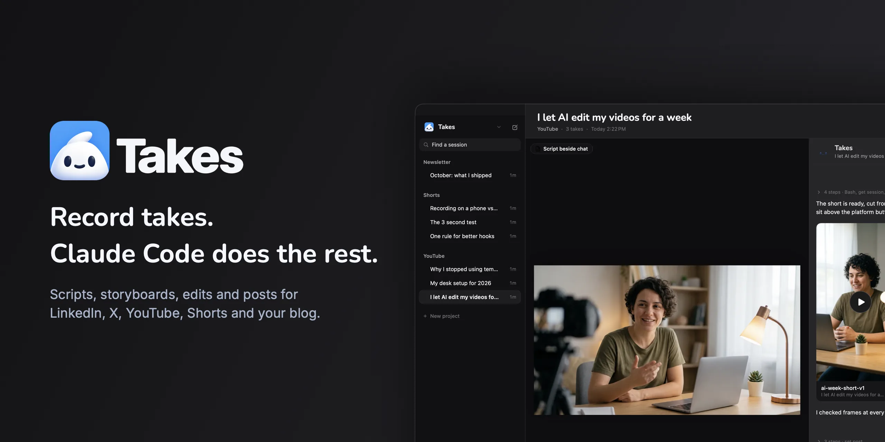
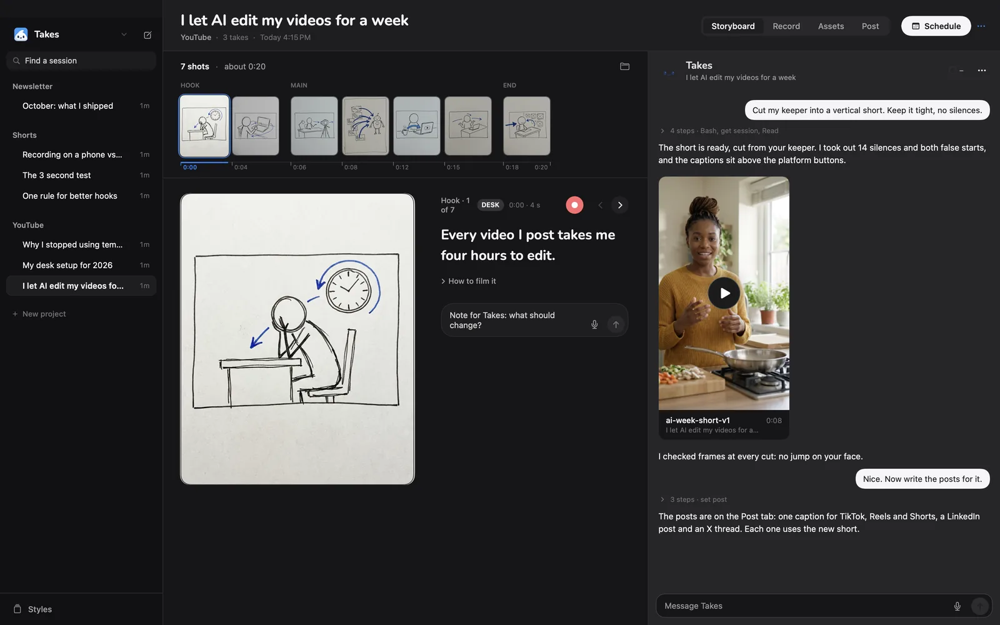
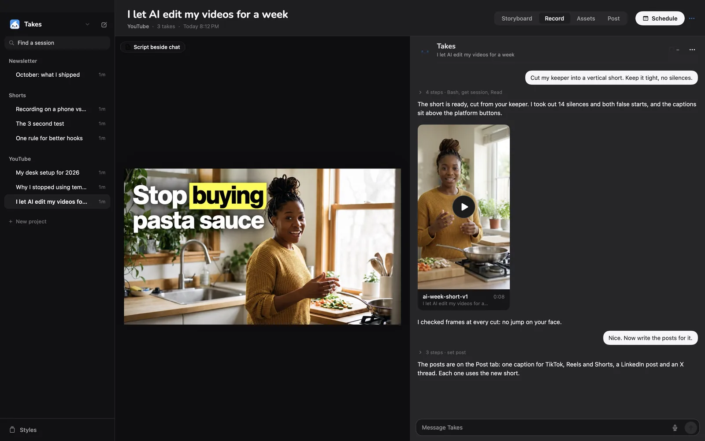
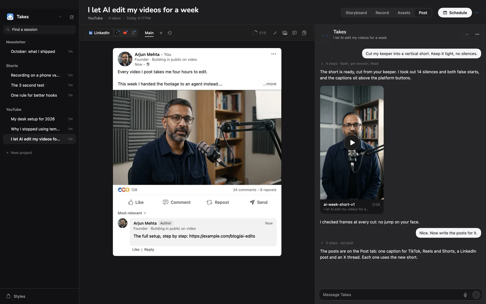
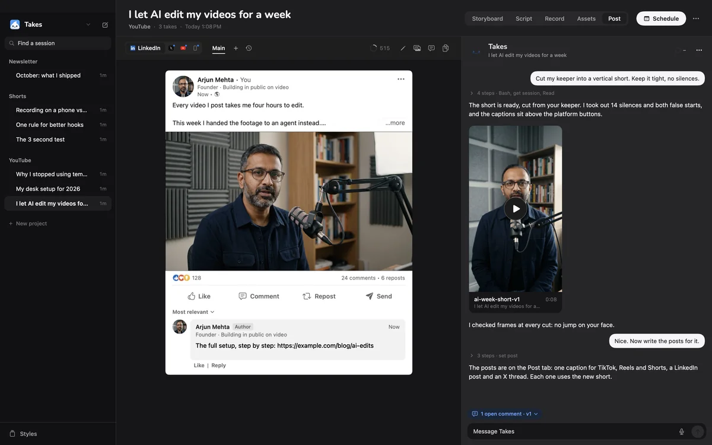
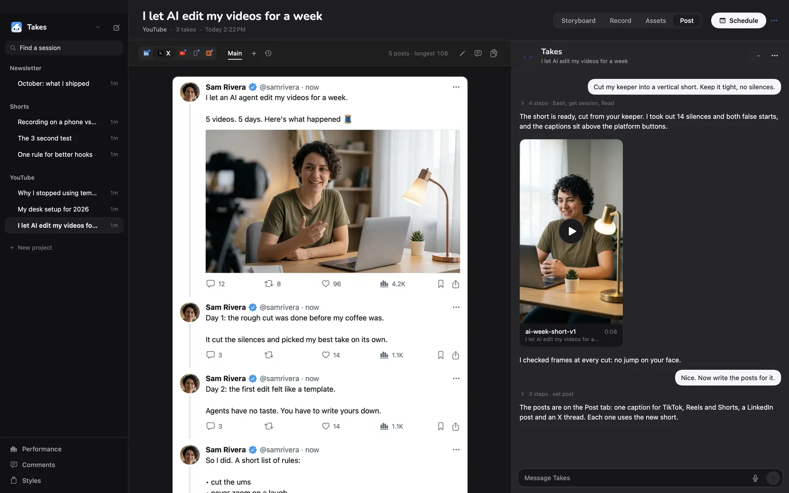
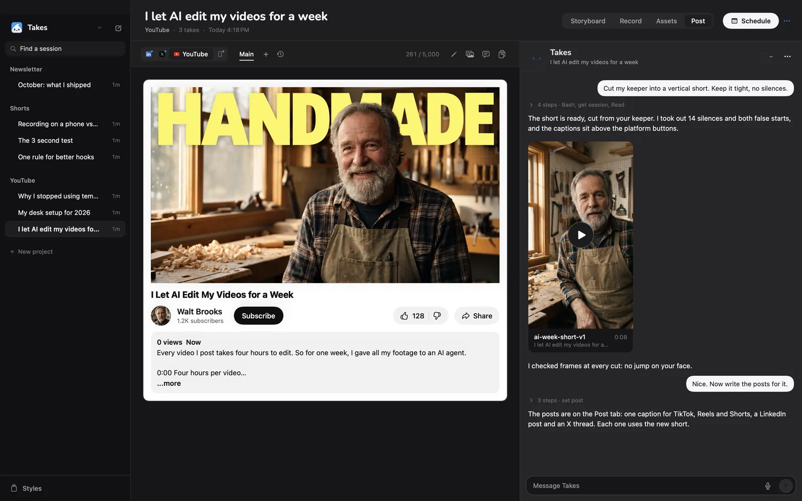
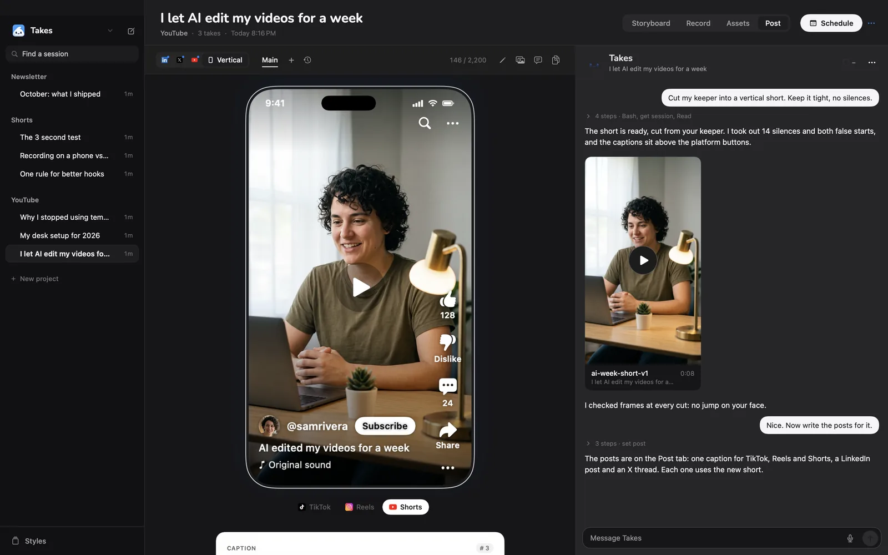
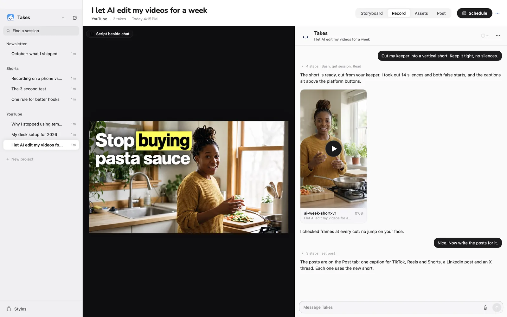
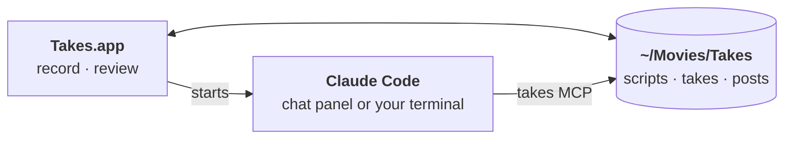

<p align="center"></p>

<p align="center">
  A Mac app for recording video takes and turning them into posts,<br>
  with <a href="https://claude.com/claude-code">Claude Code</a> working beside you.
</p>

<p align="center">
  
  
  
  
</p>

<p align="center"></p>

You write a script, record takes (camera, or camera and screen at once) and star the keeper. Claude Code reads the same files: it storyboards the video, cuts the edit, and drafts the posts for LinkedIn, X, YouTube and vertical video. Takes shows each post the way the platform will show it, so you review the real thing, not a text box.

> **Shared as is.** This is a personal tool, made public so you can read it, fork it and make it yours. It does not take pull requests (a bot closes them) and it has no support, but [Discussions](https://github.com/marvtub/takes-public/discussions) are open.

## Getting started

Paste this in Terminal:

```sh
curl -fsSL https://gettakes.app/install | bash
```

It installs Takes, ffmpeg and [Claude Code](https://claude.com/claude-code) (if you don't have them), signs you in to Claude and opens Takes. Run it again to update. Then allow the camera and mic, and press ⌘R.

<details>
<summary>Other ways to install</summary>

- **Download:** get `Takes.dmg` from [Releases](https://github.com/marvtub/takes-public/releases/latest) and drag Takes to Applications. Apple has not notarized Takes, so the first open is blocked: open System Settings > Privacy & Security and click **Open Anyway**. Then click **Finish setup** in the sidebar: it installs Claude Code and ffmpeg for you.
- **From source:** clone this repo, `brew install ffmpeg`, then `./build.sh install`.

</details>

On its first launch Takes connects itself to Claude Code: it adds the `takes` MCP server and two skills, `takes-storyboard` and `takes-video-edit`. Then ask Claude Code, in the Takes chat or any terminal: *"storyboard my next Takes video"* or *"cut my last take"*.

## What it does

**Storyboard → Record → Post.** One session holds one video, from the first idea to the posts.

| | |
|---|---|
|  | **Storyboard.** Claude writes the script and sketches every shot. A filmstrip runs along the top; each shot shows its line, how to film it and a Record button. |
|  | **Record.** A teleprompter beside the camera, hook options to pick from, script variants and history, and every take with its keeper star. Camera and screen record as two files, synced. |
|  | **Post.** One draft per platform, each shown as that platform shows it, with variants, opening hooks, history, comments for Claude and a schedule. |

**Every platform, previewed as it will look.**

<p align="center"></p>

<details>
<summary>All the screens</summary>

| LinkedIn | X thread |
|---|---|
|  |  |
| **YouTube** | **TikTok, Reels and Shorts** |
|  |  |
| **Light mode** | |
|  | |

</details>

The pictures are the real app, rendered from a made-up library.

## How it works

Your library is plain folders in `~/Movies/Takes`. The app records into them. Claude Code reads and writes them through the `takes` MCP server, which `./build.sh install` sets up. When a file changes, the app updates.



## Good to know

- **Needs:** a Mac with Apple silicon, macOS 15+, a Claude plan. The install script gets the rest. Building from source also needs the Swift toolchain (Xcode or the Command Line Tools).
- **Optional:** `whisper` for transcripts, a `GEMINI_API_KEY` for storyboard sketches, the iPhone app (`TAKES_TEAM=<team id> ios/install.sh`).
- **Questions and ideas:** [Discussions](https://github.com/marvtub/takes-public/discussions). Pull requests are closed by a bot; fork it and make it yours.
- **Tests:** `./test.sh`.

## Support

Takes is free. If it saves you time, you can buy me a coffee:

<p>
  <a href="https://paypal.me/webtotheflow"></a>
  <a href="https://venmo.com/u/MarvinAziz"></a>
</p>
