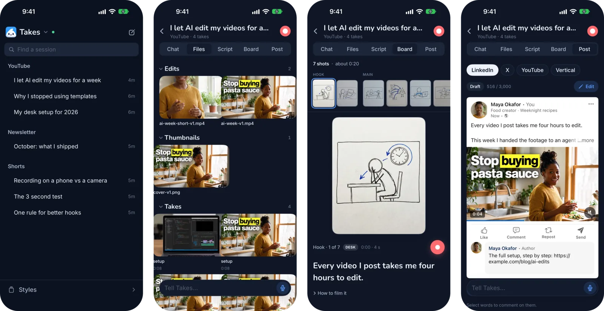
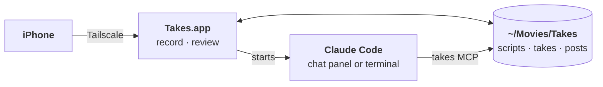

<p align="center"></p>

<p align="center">
  Record on your Mac or iPhone. <a href="https://claude.com/claude-code">Claude Code</a> writes the script,<br>
  cuts the edit and drafts the posts.<br>
  <a href="https://gettakes.app"><b>gettakes.app</b></a>
</p>

<p align="center">
  
  
  
  
  
</p>

<p align="center"></p>

Takes shows each post the way LinkedIn, X, YouTube or Shorts will show it, so you review the real thing. No coding needed, no account, no usage data: your videos stay in folders on your Mac.

## Install

Paste this in Terminal:

```sh
curl -fsSL https://gettakes.app/install | bash
```

It installs Takes, ffmpeg and Claude Code, signs you in to Claude and opens Takes. Run it again to update. You can [read the script](https://gettakes.app/install) first: it is 85 lines.

<details>
<summary>Other ways to install</summary>

- **Download:** get `Takes.dmg` from [Releases](https://github.com/marvtub/takes-public/releases/latest) and drag Takes to Applications. Takes is not notarized yet, so open System Settings > Privacy & Security and click **Open Anyway** once ([pictures of each step](https://gettakes.app/download)). Then click **Finish setup** in the sidebar.
- **From source:** clone this repo, `brew install ffmpeg`, then `./build.sh install`.

</details>

## How a video goes

1. **Storyboard.** Ask *"storyboard my next video"*. Claude writes the script and sketches each shot.
2. **Record.** Read off a teleprompter that follows your voice. Camera and screen record as two synced files. Star the take you keep.
3. **Post.** Ask *"cut my last take"* and *"write the posts"*. Review each draft as the platform shows it, leave comments on a frame or a line, and schedule it.

<p align="center"></p>

## On your iPhone

<p align="center"></p>

Your videos, takes, storyboards and posts, from anywhere. Ask Takes from the phone too. Record a take on the phone and it lands in the session on your Mac. The phone reaches your Mac over [Tailscale](https://tailscale.com); nothing goes through a server of ours.

To install it you need Xcode and an Apple ID: `TAKES_TEAM=<team id> ios/install.sh`. With a free Apple ID, install it again every 7 days.

## How it works

Your library is plain folders in `~/Movies/Takes`. The app records into them, Claude Code reads and writes them through the `takes` MCP server, and the app updates when a file changes. On its first launch Takes adds the server and two skills (`takes-storyboard`, `takes-video-edit`) to Claude Code, so you can also ask from any terminal.



## Good to know

- **Needs:** a Mac with Apple silicon, macOS 15+ and a Claude plan.
- **Optional:** `whisper` for transcripts. A Gemini key for storyboard sketches, B-roll names and best cuts: Settings › Gemini says what it adds and saves it.
- **Questions and ideas:** [Discussions](https://github.com/marvtub/takes-public/discussions). Takes does not take pull requests, so one person keeps it consistent. Forks are welcome.
- The pictures are the real app on a made-up library.

## Support

Takes is free. If it saves you time, you can buy me a coffee:

<p>
  <a href="https://paypal.me/webtotheflow"></a>
  <a href="https://venmo.com/u/MarvinAziz"></a>
</p>
